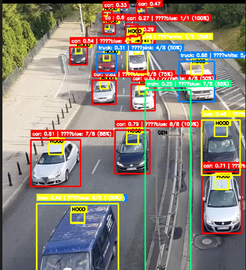
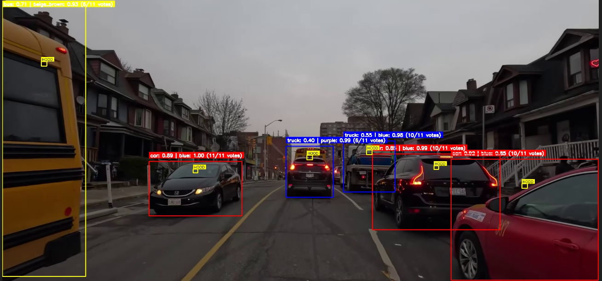
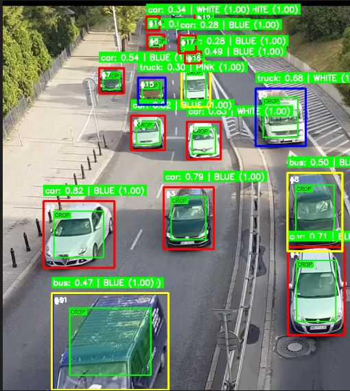
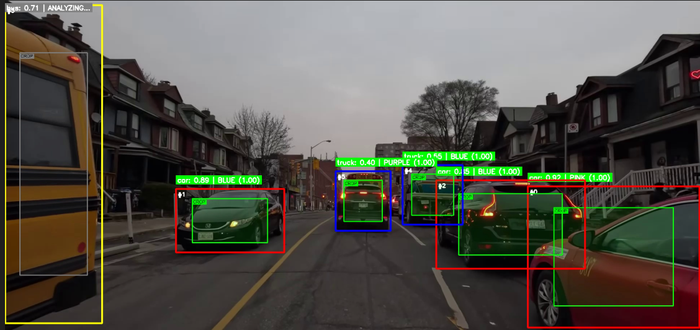
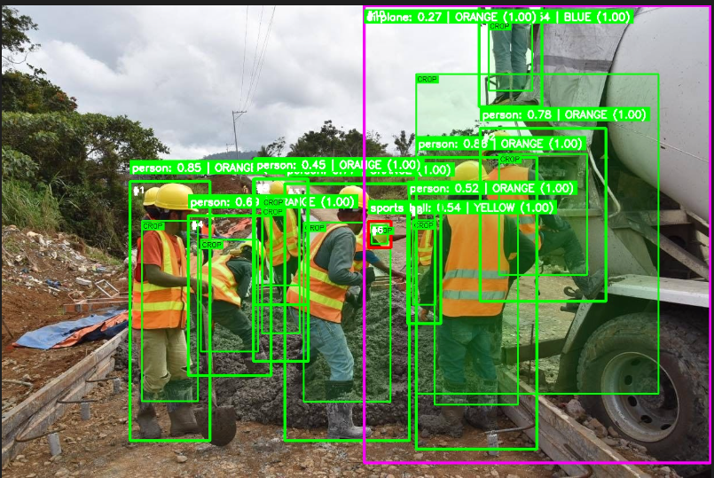
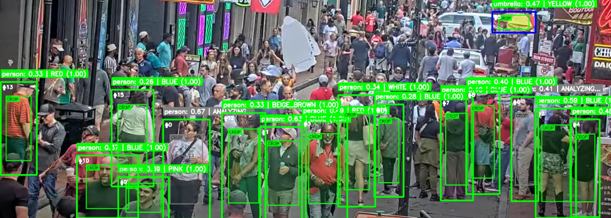

# ZMQ Color Detection System
A distributed real-time object detection and color classification system built with ZeroMQ, YOLOv8, and PyTorch. The system provides robust object detection with intelligent color recognition using a voting-based stability algorithm.
System Architecture

Client Script(8890) -> ZMQ Broker -> Yolo+Color Server(8891)

The system uses a broker pattern to enable scalable client-server communication through ZeroMQ messaging.

## Components
1. YOLO+Color Server (yolo_ultralytics_zmq.py)

* Object detection using YOLOv8
* Color classification using a custom CNN
* Robust voting system for stable color predictions
* Image preprocessing and enhancement

2. ZMQ Broker (broker.py)
Manages communication between clients and servers using ZeroMQ proxy pattern.
3. Color Classification Client (Color_client.py)
Client interface for sending images and receiving detection results.
4. System Launcher (run_zmq.sh)
Automated startup script for the entire system.
5. Model converter(convertcc.py)
Export the .pth format as ONNX format, then convert to TensorRT(.engine)

## Detection Output Format
Each detection returns an array with the following structure:
```python
[x1, y1, x2, y2, confidence, class_id, color_id, color_confidence]
```
Where:
(x1, y1, x2, y2): Bounding box coordinates
confidence: Object detection confidence
class_id: YOLO object class ID
color_id: Color class ID (-1 if unknown)
color_confidence: Color prediction confidence

## Color Classes
The system recognizes 12 distinct colors:

* beige_brown
* black
* blue
* gold
* green
* grey
* orange
* pink
* purple
* red
* white
* yellow

## Performance Tuning
* Adjust confidence_threshold for color classification sensitivity
* Modify buffer_size for voting system responsiveness
* Enable USE_GENTLE_PREPROCESSING for challenging lighting conditions
* Use different YOLO models (yolov8s, yolov8m) for accuracy vs. speed trade-offs

## Shutdown
The system handles shutdown:
```python=
# Press Ctrl+C to stop all components
# Or kill individual processes
pkill -f broker.py
pkill -f yolo_ultralytics_zmq.py
```
# Personal Experiment
Using testing.py as simple inference code, I've experimenting and analyzing the results of the Voting system, Smoothing system, gentle preprocess, and without any preprocess.


Above are the inference result using hard preprocessing and crop the specific small area of Object Detection Bbox.
Actually I've tried images of person, the results are better compared to the cars result but not documented.

===========================================================




Above are the inference result without preprocess and crop the dominant color from the Object Detection Bbox. As shown above, the image of person are much better compared to car images.

## Conclusion
After quite a while of experiment, I've concluded :
* Results are better without hard preprocess, better with or without gentle preprocess.
* Cropping the small area of the Object Detection Bbox can lead to crop the unwanted part (Cropped background instead of car or person or any objects targeted.) resulting to miss color detecting (Car should be white or any color but background possibly any color unmatch to car or any target color.)
* Large number of voting method lead to worse results, instead of 11 vote decrease the vote number to 5 or else.
* Color class sequence SHOULDN'T be changed, should be the same as the trained data folder sequence.
* Much things to improve.

note : 
- Every inference here is tested using testing.py for efficiency purpose.
- Video test data and results are available in yolo_ultra folder.


